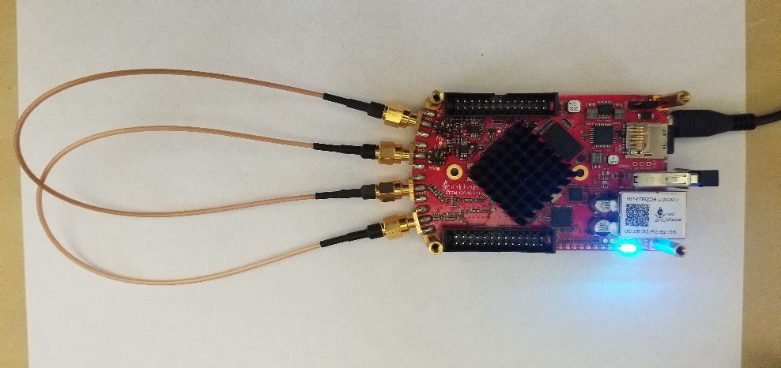
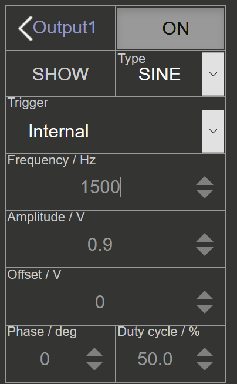
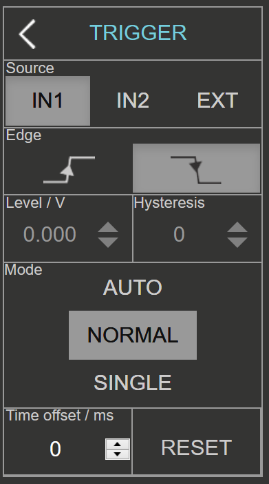
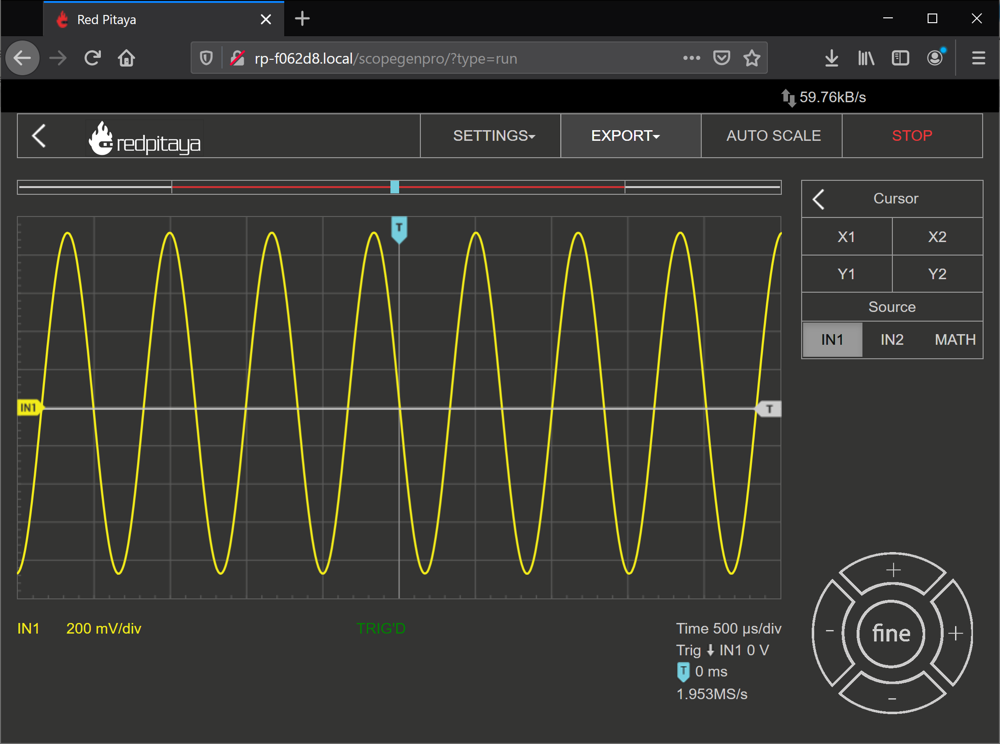
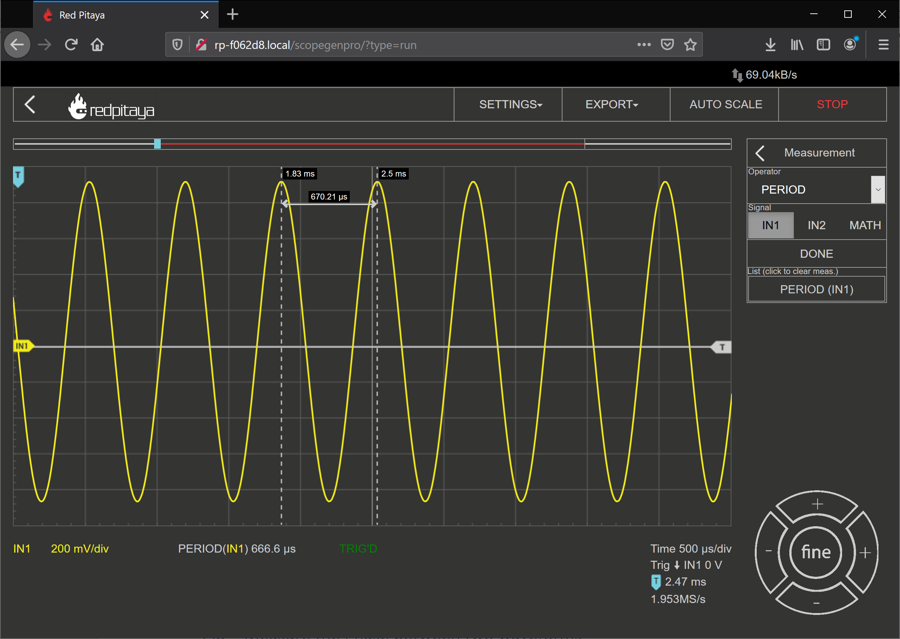

Using the Red Pitaya for measuring properties of periodic waveforms
===================

Goals of this Lab
----------------------
1. Demonstrate ability to use Oscilloscope, Signal Generator, and Spectrum Analyzer capabilities of Red Pitaya through GUI.

2. Configure Red pitaya to receive external inputs.

3. Perform measurements on a multitude of periodic waveforms

Tasks / Measurements
-----------------------

Configure the Red Pitaya for a Loopback configuration (SMA cables tied between the outputs and inputs to the Red Pitaya) as shown in Fig. 1.

Fig. 1: Red Pitaya in Loopback Configuration

Measure the Period of a waveform – Time Domain
-----------------------
Open the Oscilloscope & function Generator Application.

Configure the output of the red pitaya for a 1500Hz Sinusoid as shown in Fig. 2.

Fig. 2: OUT1 Configuration for measuring period/frequency

Configure the trigger for a negative edge trigger with zero level and normal trigger mode as shown in Fig. 3.

  

Fig. 3: Trigger Configuration

Enable OUT1. You should now see a figure close to the following

Fig. 4: Target output for 1500 Hz Sinusoid with negative edge triggering

To measure the period,

1. Select the “Cursor” box, and enable “X1”, “X2” options.

2. Drag each cursor to a common feature of the waveform (peak to peak, trough to trough)

3. Read off spacing between cursors. This is an approximate measure of the period

Period can also be measured by the red pitaya itself, under the meas command by selecting “Period” and “IN2”, and finally selecting “Done”.
This is shown in Fig. 5.

Fig. 5: Measured waveform vs Cursor measurement
